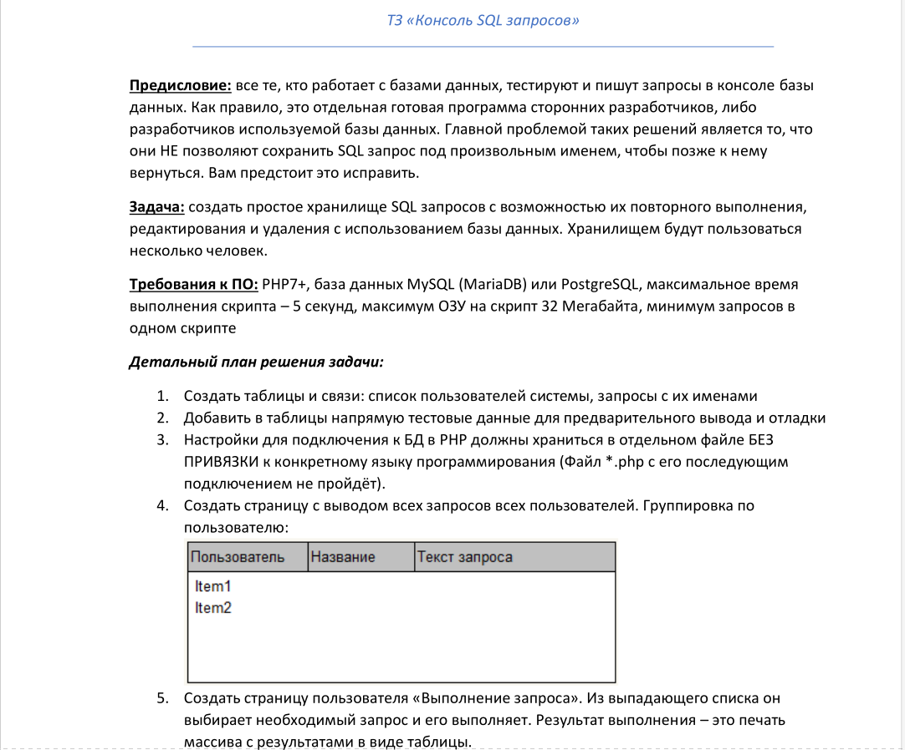
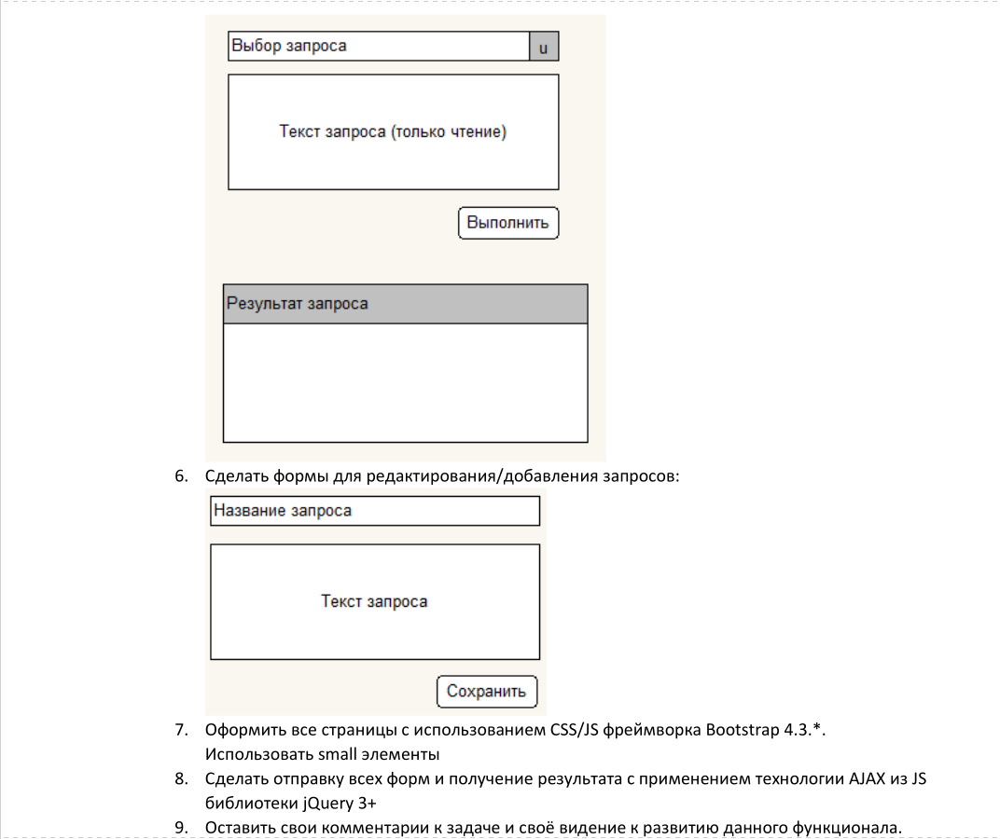
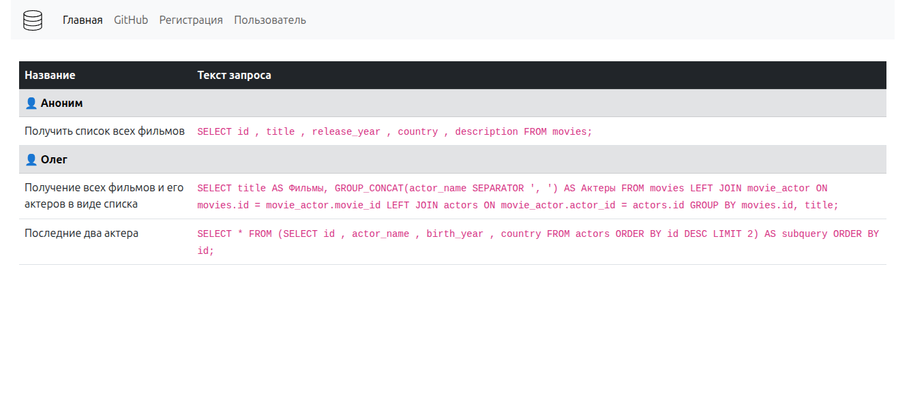
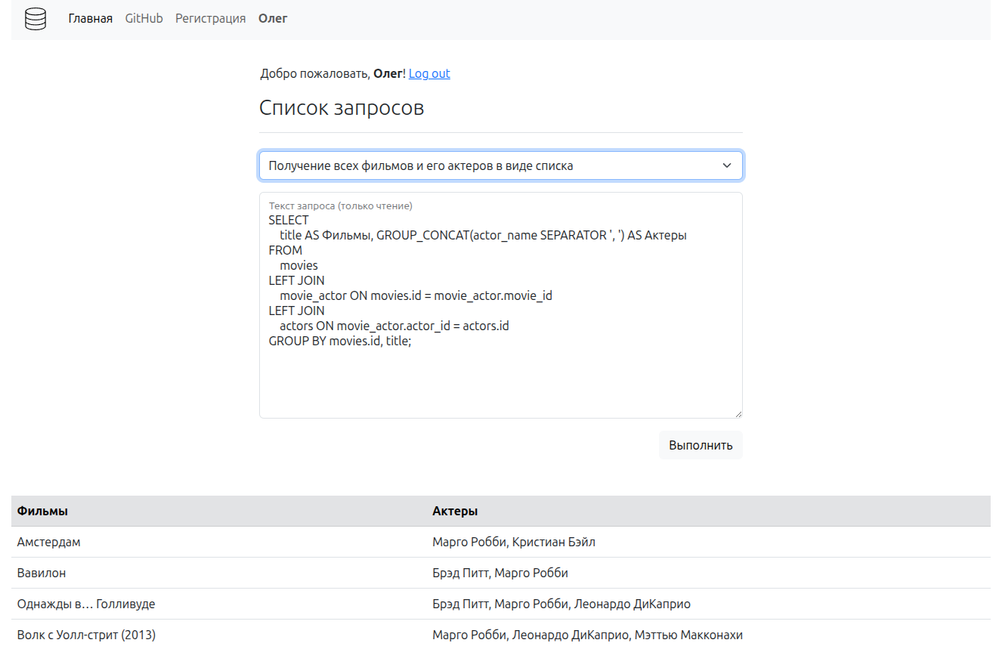

# 📑 Notice


## 💻 Стэк
- **PHP**
- **MySQL**

---

### 🚀 Запуск проекта

1. **База данных**: Создайте БД.
2. **Окружение**: 
   - Скопируйте файл `.env.example` в новый файл `.env`
   - Укажите в `.env` ваши данные для подключения к MySQL.
3. **Сервер**: Запустите встроенный сервер PHP из корня проекта:
   ```bash
   php -S localhost:8000

---

### 📋 Техническое задание

<details>
  <summary>Нажмите, чтобы просмотреть подробности ТЗ</summary>
  
  
  

</details>

---

### 📸 Результат
#### Все пользователи и их запросы


---
#### Пользовательский интерфейс




